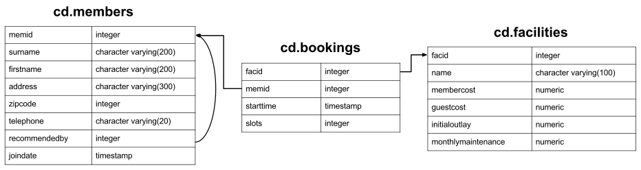

# Задача №4

---

### Контекст

Имеется база данных для недавно созданного загородного клуба. В ней имеется информация о членах этого клуба, объектов для 
отдыха, таких как теннисные корты, и истории бронирования. Помимо прочего, клуб хочет понять, как они могут использовать 
свою информацию для анализа использования/спроса на объекты. __Обратите внимание__: этот набор данных предназначен 
исключительно для интересного набора упражнений, а схема базы данных несовершенна в нескольких аспектах — пожалуйста, не
воспринимайте ее как пример хорошего дизайна.

В БД в схеме `cd` имееются 3 таблицы.  

---

**Таблица `cd.members`**

```postgresql
CREATE TABLE cd.members(
    memid          INTEGER                NOT NULL,
    surname        CHARACTER VARYING(200) NOT NULL,
    firstname      CHARACTER VARYING(200) NOT NULL,
    address        CHARACTER VARYING(300) NOT NULL,
    zipcode        INTEGER                NOT NULL,
    telephone      CHARACTER VARYING(20)  NOT NULL,
    recommendedby  INTEGER,
    joindate       TIMESTAMP              NOT NULL,
    
    CONSTRAINT members_pk PRIMARY KEY (memid),
    
    CONSTRAINT fk_members_recommendedby FOREIGN KEY (recommendedby)
        REFERENCES cd.members(memid) ON DELETE SET NULL
);
```

У каждого участника есть идентификатор (не обязательно последовательный), основная информация об адресе, ссылка на 
участника, который рекомендовал их (если есть), и отметка времени, когда они присоединились.

---

**Таблица `cd.facilities`**

```postgresql
CREATE TABLE cd.facilities(
   facid               INTEGER                NOT NULL, 
   name                CHARACTER VARYING(100) NOT NULL, 
   membercost          NUMERIC                NOT NULL, 
   guestcost           NUMERIC                NOT NULL, 
   initialoutlay       NUMERIC                NOT NULL, 
   monthlymaintenance  NUMERIC                NOT NULL, 
   
   CONSTRAINT facilities_pk PRIMARY KEY (facid)
);
```

В таблице перечислены все доступные для бронирования объекты, которыми располагает загородный клуб. Клуб хранит 
информацию об идентификаторе/имени, стоимости бронирования как членов, так и гостей, первоначальную стоимость строительства объекта и предполагаемые ежемесячные расходы на содержание.

---

**Таблица `cd.bookings`**

```postgresql
CREATE TABLE cd.bookings(
   bookid     INTEGER   NOT NULL, 
   facid      INTEGER   NOT NULL, 
   memid      INTEGER   NOT NULL, 
   starttime  TIMESTAMP NOT NULL,
   slots      INTEGER   NOT NULL,
   
   CONSTRAINT bookings_pk PRIMARY KEY (bookid),
   
   CONSTRAINT fk_bookings_facid FOREIGN KEY (facid) REFERENCES cd.facilities(facid),
   
   CONSTRAINT fk_bookings_memid FOREIGN KEY (memid) REFERENCES cd.members(memid)
);
```

И таблица, отслеживающая бронирование объектов. В нем хранится идентификатор объекта, член, который сделал бронирование,
начало бронирования и количество получасовых «слотов», на которые было сделано бронирование.

---

Схематически это выглядит примерно так:


### Постановка

Составьте список общего количества слотов, забронированных по каждому объекту в месяц в 2012 году. 
В эту версию включите выходные строки, содержащие итоги за все месяцы по объекту и итоги за все месяцы по всем объектам.
Выходная таблица должна состоять из идентификатора объекта, месяца и слотов, отсортированных по идентификатору и месяцу. 
При вычислении агрегированных значений для всех месяцев и всех `facid` возвращайте нулевые значения в столбцах `month` и 
`facid`.

### Ожидаемый формат ответа

Ваш запрос должен возвращать таблицу формата:

| facid | month | slots |
|-------|-------|-------|
| 0     | 7     | 270   | 
| 0     | 8     | 459   | 
| 0     | NULL  | 729   | 
| 1     | 10    | 100   | 
| 1     | 12    | 300   | 
| 1     | NULL  | 400   | 
| ...   | ...   | ...   | 
| NULL  | NULL  | 10000 |
